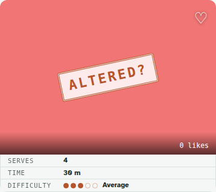
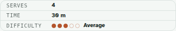

# RUN-RECIPE-META-STRIP — run summary

Add **serves** and **difficulty** alongside the existing prep time, and present all three
as a three-row strip hanging off the bottom of the recipe image, Wikibooks-infobox style.

Order is deliberate and most-consequential-first: **Serves** (changes what you buy) →
**Time** (changes whether you cook it tonight) → **Difficulty** (checked last and least).

Branch: `claude/recipe-metadata-strip-dksgyo`. Run artifacts: `runs/recipe-meta-strip/`.

---

## 1. D0 discovery — findings quoted verbatim (§7)

Full report: `runs/recipe-meta-strip/D0-discovery.md`. Source of truth is the locally-held
schema-of-record `tests/fixtures/lexicons/exchange.recipe.recipe.json`.

**Q1 — servings / yield / difficulty on `exchange.recipe.recipe`?**

- `recipeYield` — **present**, verbatim:
  ```json
  "recipeYield": { "type": "string", "description": "Number of servings or yield" }
  ```
  A free-text string, so it already holds `"1-2"`, `"4 burgers"`, `"4"` faithfully.
- Dedicated `servings` — **absent** (`recipeYield` doubles for both).
- `difficulty` — **absent** (no such field anywhere in the record).

**Q2 — how is prep time represented? (verbatim current definition)** Structured ISO-8601
duration strings, three separate fields:

```json
"prepTime":  { "type": "string", "format": "duration", "description": "Time required for preparation" },
"cookTime":  { "type": "string", "format": "duration", "description": "Time required for cooking" },
"totalTime": { "type": "string", "format": "duration", "description": "Total time required" }
```

Parsed/produced as `PT#H#M#S` (`isoDurationToMinutes`/`minutesToIso` in `write.ts`;
`formatDuration` in `present.ts`, `"PT1H35M" → "1 h 35 m"`).

**Q3 — what does the recipe page render for time, and where?** `chipsEl(value)` in
`view.ts` rendered `formatDuration(value.totalTime)` as a single `<span class="chip">`
**below the title** — DOM order `banner → actions → title-row → .chips → lede` — i.e. the
time chip was **detached from the image**, not hanging off it. Only `totalTime` was shown.

**Path branch (per-field):** serves = **Path A** (`recipeYield`); time = **Path A**
(ISO `totalTime`/`prepTime`); difficulty = **Path B** (no upstream field).

## 2. Owner decisions

- **O1 (difficulty storage):** **B3 now** — an open-world `difficulty` (integer 1–5)
  written only on records arecipe authors — with a **B1→B2 follow-on filed in `TODO.md`**
  (propose upstream to recipe.exchange; consider an `app.arecipe.recipeMeta` sidecar for
  cross-app coverage). **No amendment to `exchange.recipe.recipe`** (§ acceptance 6).
- **O2 (Focus mode):** **suppress difficulty** — Focus keeps serves + time (a during-cook
  surface; difficulty is a pre-cook decision). The renderer takes a `focus` flag and is
  tested in both positions.

## 3. What shipped

| Layer | File | What |
| --- | --- | --- |
| D1 data model | `src/recipes/meta.ts` (new) | `RecipeMeta` + pure parsers `parseServes`/`parseTime`/`parseDifficulty` + normalizer `recipeMetaOf`. `display` authoritative (free text verbatim); `hint` only for sort/filter. |
| D2 render | `src/recipes/view.ts` | `renderMetaStrip(meta, {focus?, standalone?})` → `<dl class="meta-strip">` or `null`. Dots are `aria-hidden` decoration; the label is the accessible value. |
| D3 placement | `src/recipes/view.ts` | Strip attached under the image in a clipped `.recipe-hero` (reads as one object); standalone (all corners rounded) when no image; wired into the recipe detail **and** Focus view. The old below-title time chip was removed from the detail (chip retained for card surfaces, out of scope). |
| D4 search | `src/recipes/search.ts` | `servesHint`/`timeHintMinutes`/`difficulty` added as **stored** (not indexed) fields — present for a future sort/filter run, no ranking change, **no filter UI**. |
| Styling | `styles.css` | `.recipe-hero`, `.meta-strip[--standalone]`, `.meta-row`, `.dot[--on/--off]`. Labels in the utility register (mono, uppercase, letter-spaced, lower emphasis); values carry the weight; hairline row separators; dots in `--rust`. |
| Registry | `docs/LEXICONS.md` | Documented the B3 `difficulty` + forward-compatible `servings` open-world fields. |

## 4. TDD — red before green

Every deliverable had a failing test first (§ acceptance 2):

- **D1** `tests/unit/recipes/meta.spec.ts` — written first, ran **RED** with
  `ERR_MODULE_NOT_FOUND` (no `meta.ts`); **GREEN** (21 tests) after implementing the module.
- **D2** render tests appended to `tests/unit/recipes/view.spec.ts` — ran **RED** (14 failing,
  `renderMetaStrip` not exported); **GREEN** (58 tests) after implementing the function.
  Covers all 8 presence combinations (all-absent → `null`), stable row order, the `<dl>`
  structure, `aria-hidden` dots, the difficulty row's accessible label, the O2 focus flag in
  **both** positions, the standalone flag, and a markup snapshot per combination.
- **D4** `tests/unit/recipes/search.spec.ts` — added `searchDocOf` hint coverage; the
  **existing search suite passed unmodified**, proving behaviour is unchanged.

Final gate (this environment runs e2e via a throwaway local Playwright config per
`CLAUDE.md`; it was removed before committing):

- `npm run lint` ✓ · `npm run typecheck` ✓
- `npm run test:unit` — **913 passed** (87 files)
- `npm run build` ✓
- e2e (all specs) — **242 passed**, including the new `tests/e2e/meta-strip.spec.ts`.

## 5. Measured acceptance criteria

- **Contrast (§ acceptance 4) — measured, not asserted:** the difficulty dots (`--rust`
  `#b4552d`) on the strip background (`--tile` `#f4f7f5`) compute to **4.55 : 1** (in-page
  WCAG relative-luminance calc in the e2e). Non-text-contrast safe (min 3:1); matches the
  spec's ~4.5:1. `--yolk` (ruled out at ~2:1) is not used. Empty dots are outlined in the
  same stroke at reduced opacity — never a lighter fill that would drop below threshold.
- **Height budget (§4) — tested:** at a 390px viewport the whole strip is **61.5px** against
  a **256px** image = **24.0%**, under the 25% ceiling. Guarded by an e2e assertion.

## 6. Screenshots (§ acceptance 3, 5)

All in `runs/recipe-meta-strip/shots/`. Every one of the **eight presence combinations** at
**390px and 1280px** (`{0-none … 7-all}-{390,1280}.png`), plus the two §5 cases.

All three (390px) — attached under the image, reads as one object:



No-image standalone (all corners rounded, its own top edge):



Focus mode (difficulty suppressed — serves + time only, O2):


The `0-none` shots show the image alone with its normal corner treatment (no empty
container) — proving the degrade-to-nothing path. Combos `4`/`5`/`6` exercise the free-text
edges: serves `"1-2"` (ranged hint), yield `"4 burgers"` (no hint, rendered in the serves
row), and `PT1H35M` time.

_Note: the hermetic screenshots carry an `ALTERED?` stamp and a like overlay — artifacts of
the routed-fixture recipe page (a mutated record value against a fixed CID trips the
integrity check). They are unrelated to the strip._

## 7. Scope honored

Out of scope and untouched (§8): card surfaces, filter/sort UI, nutrition/energy, yield as
its own row, and editing these fields in the recipe editor (a follow-on once O1's storage
path settles). `exchange.recipe.recipe` was **not** amended.
